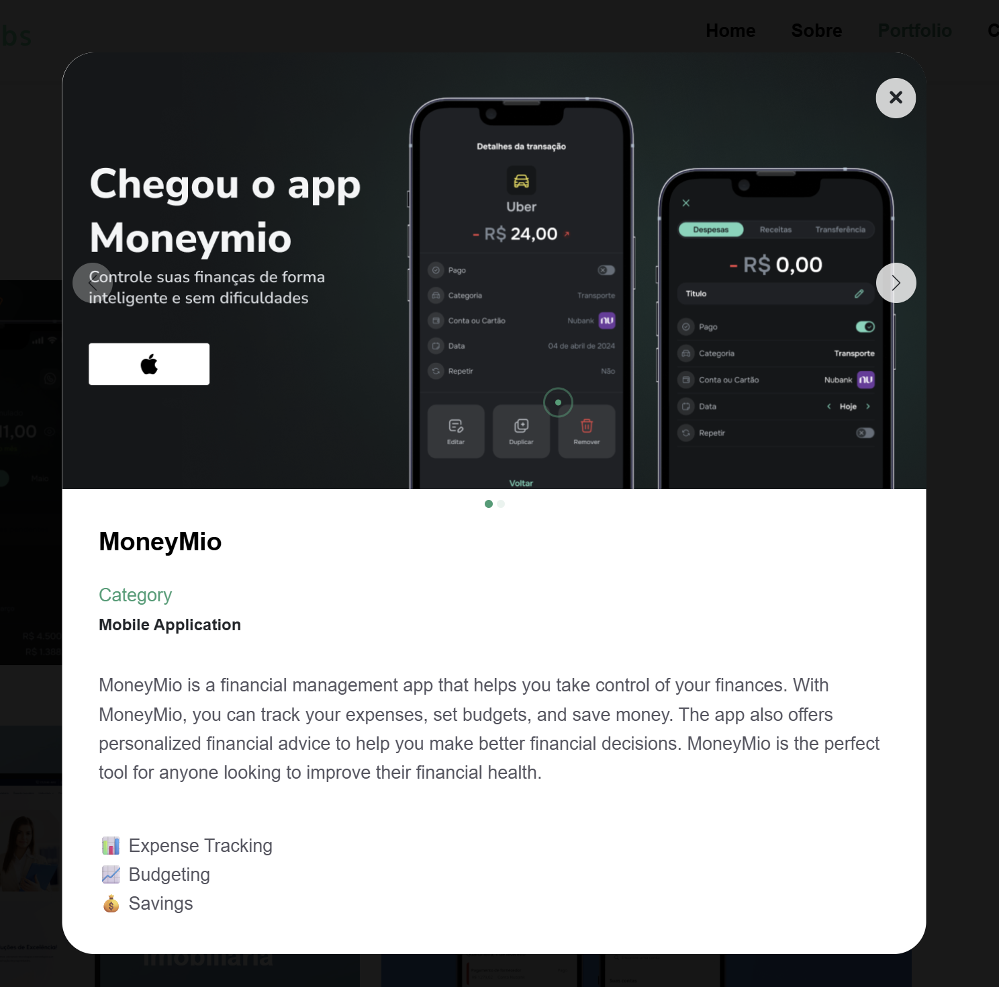

# MoneyMio 💰

> Fintech que simplifica a vida financeira: registre gastos e receitas conversando no WhatsApp. A IA organiza, categoriza e te devolve relatórios completos.

🌐 **Site oficial:** [moneymio.com.br](https://moneymio.com.br)

📱 Disponível na App Store e no Google Play.

## Telas do app

  

  
  

## O problema

Apps de finanças pessoais exigem disciplina: abrir o app, preencher formulário, categorizar. A maioria das pessoas desiste na primeira semana e volta a não saber para onde o dinheiro vai.

## A solução

O MoneyMio vive onde você já está: o **WhatsApp**. Basta mandar "gastei 50 no mercado" e a IA registra e categoriza automaticamente. Relatórios financeiros detalhados ficam disponíveis no aplicativo.

## Funcionalidades

- **Registro por conversa**: texto natural no WhatsApp, sem formulário
- **Categorização automática** com IA
- **Relatórios detalhados** no app
- **Categorias personalizadas**: organize do seu jeito
- **Publicado nas lojas**: iOS e Android
- **Zero fricção**: nada de app novo pra criar hábito, o hábito já existe, é o WhatsApp

## Meu papel

Sou **co-fundador** do MoneyMio: produto, tecnologia e estratégia. É a minha startup e o projeto mais importante do meu portfólio.

## Stack

`IA (LLM)` `WhatsApp API` `React` `Supabase (Postgres)`

> 🔒 Este repositório é a vitrine do produto. O código-fonte é privado.

---

Feito por [Caio Cruz](https://github.com/CaiioFe) · [iacaio.com.br](https://iacaio.com.br)
